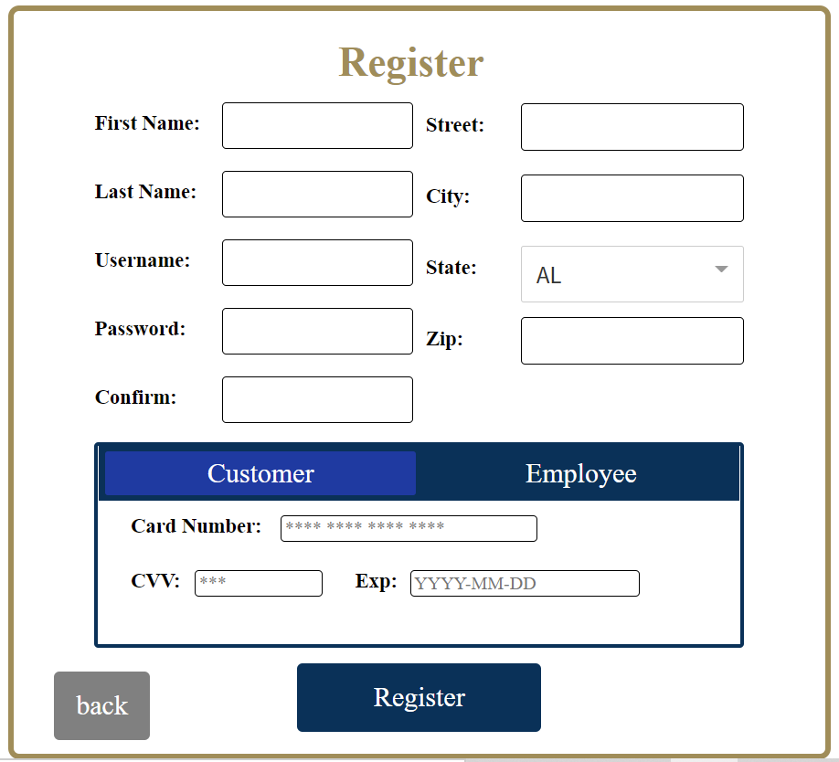
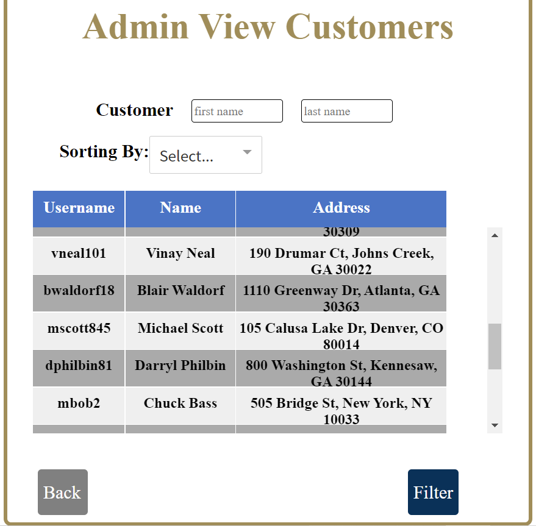
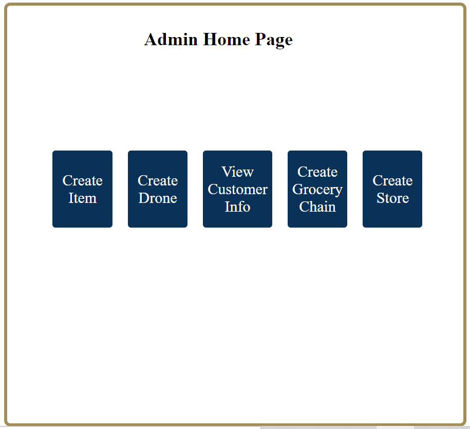

## Drone Delivery App
This is a group project developed with React.js, Node.js, Express.js, MySQL. 
 

### How to run it

- Set up backend environment [(link)](https://github.gatech.edu/cs4400group35/cs4400_Phase4/tree/master/backend)
- Set up frontend environment and run it [(link)](https://github.gatech.edu/cs4400group35/cs4400_Phase4/tree/master/frontend)

### Developers

Yulai Cui  
Jiayu Lu  
Shiyi Wang  
Junqi Xu  

### Screenshots

